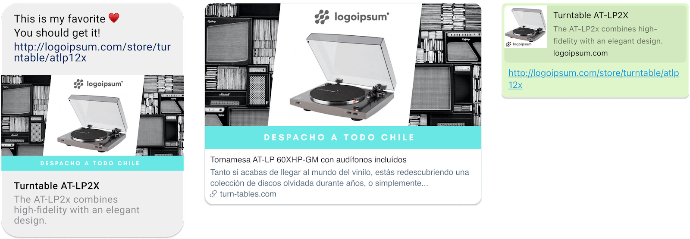

create-flayyer-app
==================

[](https://flayyer.io/v2/flayyer/default/main.jpeg?title=try+changing+this)

[](https://flayyer.io/v2/flayyer/default/main.jpeg?title=awesome!+%F0%9F%98%83&description=Optional+description&_w=1080&_h=1920)

**Create [Flayyer.com](https://flayyer.com?ref=create-flayyer-app) app**

📚 Please read the documentation here: [https://docs.flayyer.com/docs/](https://docs.flayyer.com/docs/)


[](https://oclif.io)
[](https://npmjs.org/package/create-flayyer-app)
[](https://npmjs.org/package/create-flayyer-app)
[](https://github.com/flayyer/create-flayyer-app/blob/master/package.json)

<!-- toc -->
* [Usage](#usage)
<!-- tocstop -->

# Usage

Start by invoking `create-flayyer-app`.

```sh
npm init flayyer-app@latest my-project
```

With yarn:

```sh
yarn create flayyer-app my-project
```

Then cd into your new created `my-project` directory and install the dependencies.

```sh
cd my-project
npm install
```

Create and edit templates inside the `templates` directory.

Once you are ready execute `npm run deploy` but with your API key

```sh
export FLAYYER_KEY=...
npm run build
npm run deploy
```

> Get your FLAYYER_KEY at [https://flayyer.com/dashboard/_/settings](https://flayyer.com/dashboard/_/settings) 👈

Great! 🎉
Now your new template deck should appear there.

If you need to update your templates you can just run `npm run deploy` again.

## Dynamic og:image

You can use the resulting URLs to create dynamic `<meta property="og:image" />` for your websites.

See the official guides: https://docs.flayyer.com/guides

[](https://flayyer.com?ref=create-flayyer-app)
